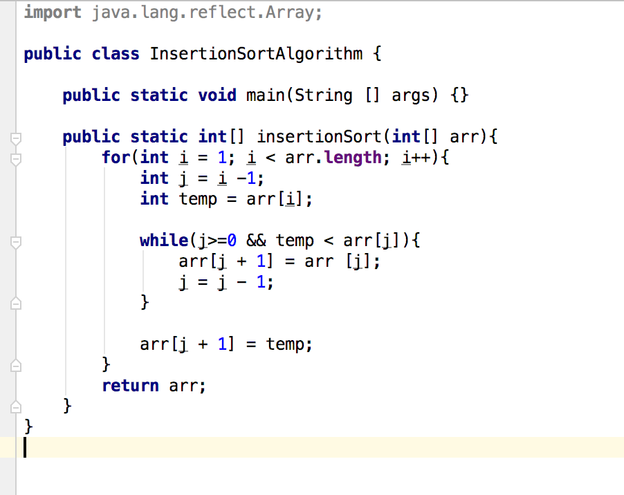
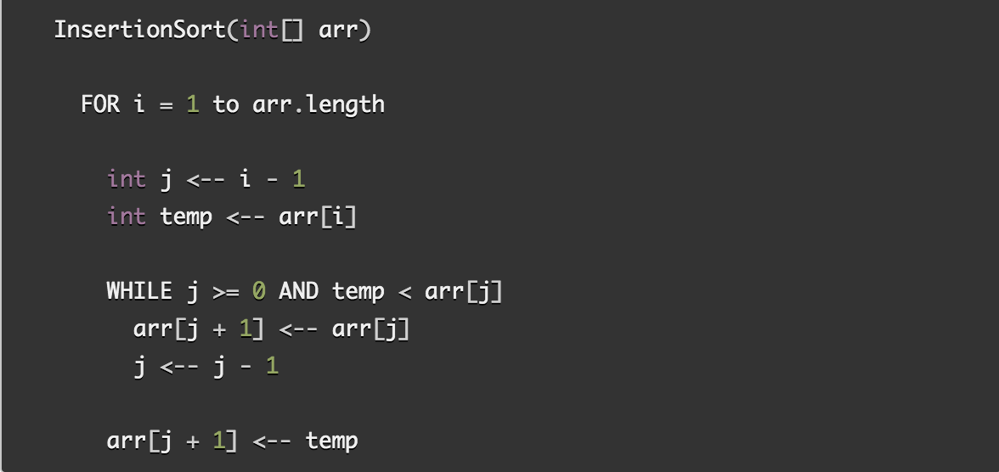

#Lecture Notes: Merge Sort
This algorithm is is about sort the given int array.

## Learning Objectives
To learn the use of insertionSort method that sorts the given int array

## Lecture Flow
Arrays are used to store multiple values in a single variable, instead of declaring separate variables for each value.  
Sorting is important in programming as it makes it  easier and faster to locate items when it is sorted.
   
###Another main point
More details 
If the data are sorted it is easier to analyse duplicate entities.  
If the data are sorted it is easier to compare two arrays.  
If the data are sorted it is easier to find any int in that array.  

## Algorithm
Describe in detail how the algorithm works. Include small code snippets to possibly support the points

## Pseudocode
  

## Readings and References
## Watch Video
[Video](https://www.youtube.com/watch?v=3CJq3XV2PBU)

## Read
[Article 1](http://www.geekinterview.com/question_details/67252)

[Article 2](https://www.cs.cmu.edu/~adamchik/15-121/lectures/Sorting%20Algorithms/sorting.html)